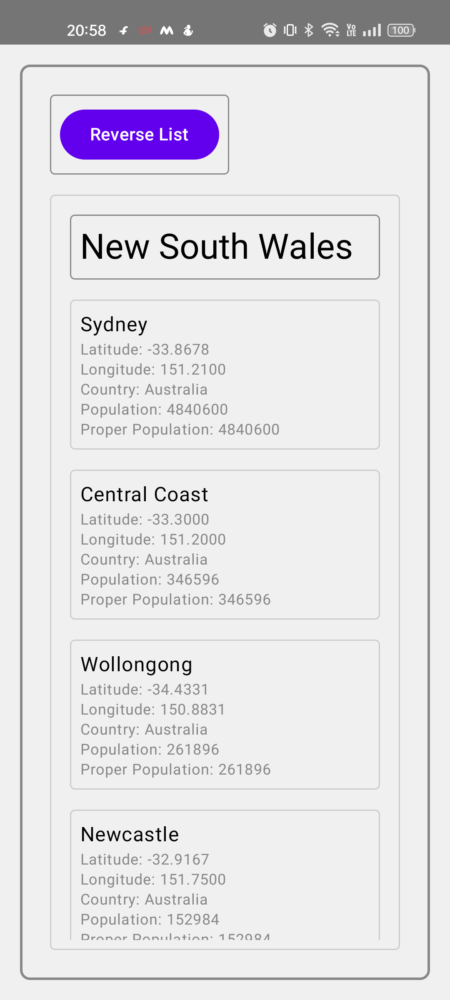
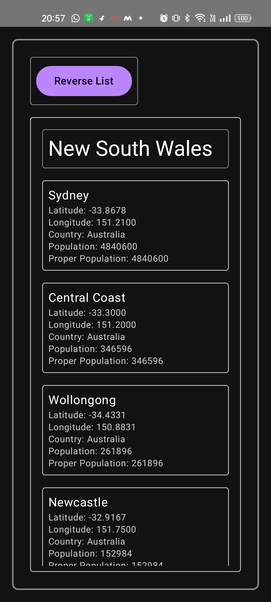

# JetPackComposeDemo

## Overview
This project demonstrates the use of JetPackCompose in an Android application. The main activity initializes a `CityViewModel` using a factory pattern and displays a list of cities grouped by their administrative names. The UI adapts to the system's dark and light themes.

## Features
- Dependency injection with Hilt
- ViewModel initialization using a factory
- Dynamic theming with dark and light modes
- Displaying a list of cities grouped by administrative names
- Loading city data from a JSON file using `CityRepository`

## Screenshots
### Light Theme

### Dark Theme

## Dependencies
- AndroidX
- Hilt for dependency injection
- Jetpack Compose for UI
- ViewModel and LiveData
- Gson for JSON parsing
